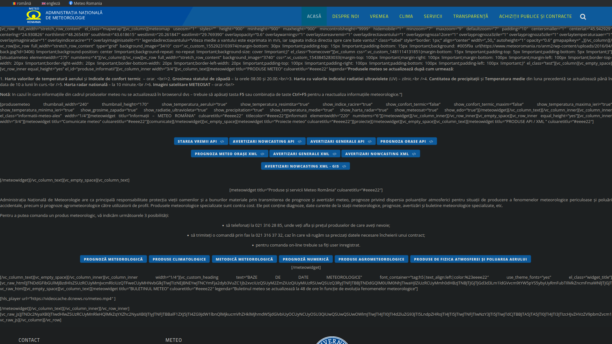

# Nu mă bate vântule

Mi-a dat un prieten un link să văd și eu ce fail e pe [mdev.greencloud.ro](https://mdev.greencloud.ro/).



După ce am văzut ce oferă API-ul mare nerd snipe ce mi-am luat și nu m-am putut abține să nu fac o hartă cu datele alea

## Mașina timpului

Arhiva: un roboțel (GitHub Action) trage datele din oră-n oră și le bagă în git. Fiecare commit e o poză cu cerul în momentul ăla — și o ștampilez cu ora reală a observației, nu cu ora la care s-a trezit robotul să ruleze. Dacă nu s-a schimbat nimic, nu face commit.

Adică **git log-ul ăsta e literalmente istoricul vremii**. În aplicație dai pe *Istoric*, alegi o zi din calendar, tragi de slider prin ore și harta se redesenează exact cum era cerul atunci. Cu cât trece timpul și se adună commit-urile, cu atât te poți întoarce mai în spate.

Deci, după cum zicea și marele poet Mihai Eminescu în *Glossă*:

```
Vreme trece, vreme vine,
Toate-s vechi și nouă toate;
```

sau ilustrul Renato din Sălaj în *Nu e înjoseala (N-am cărți de credit)*:

```
Prea multe nu-ți pot oferi
'cât să ajung să fac tâlhării
Tu ca Starea Vremii
Tu m-anunți când vine vara
```

[](https://youtu.be/ftSjcuvLh9I)

---

Tot tacâmul e scris în Rust (egui), merge și pe desktop și direct în browser pe wasm.

